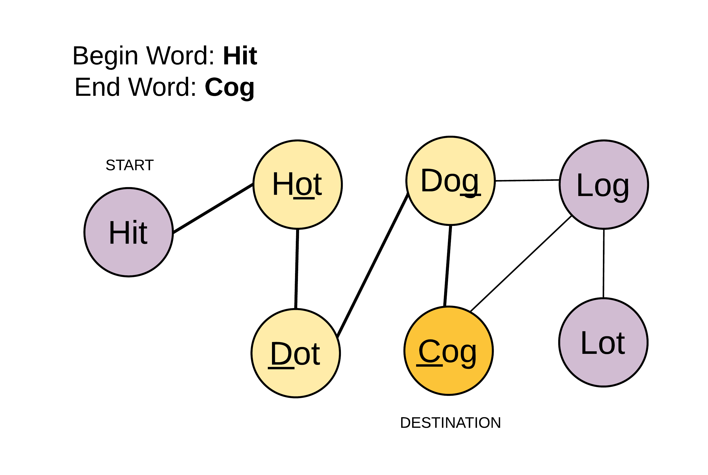

# 127. Word Ladder

## Question

> Given two words \(_beginWord_ and _endWord_\), and a dictionary's word list, find the length of shortest transformation sequence from _beginWord_ to _endWord_, such that:
>
> 1. Only one letter can be changed at a time.
> 2. Each transformed word must exist in the word list. Note that _beginWord_ is _not_ a transformed word.
>
> **Note:**
>
> * Return 0 if there is no such transformation sequence.
> * All words have the same length.
> * All words contain only lowercase alphabetic characters.
> * You may assume no duplicates in the word list.
> * You may assume _beginWord_ and _endWord_ are non-empty and are not the same.
>
> **Example 1:**
>
> ```text
> Input:
> beginWord = "hit",
> endWord = "cog",
> wordList = ["hot","dot","dog","lot","log","cog"]
>
> Output: 5
>
> Explanation: As one shortest transformation is "hit" -> "hot" -> "dot" -> "dog" -> "cog",
> return its length 5.
> ```
>
> **Example 2:**
>
> ```text
> Input:
> beginWord = "hit"
> endWord = "cog"
> wordList = ["hot","dot","dog","lot","log"]
>
> Output: 0
>
> Explanation: The endWord "cog" is not in wordList, therefore no possible transformation.
> ```

## Analysis

#### Solution \#1: BFS

The problem is transformed to finding the shortest path in a undirected graph.



\(Image above is from ref: [https://leetcode.com/problems/word-ladder/solution/](https://leetcode.com/problems/word-ladder/solution/)\)

BFS can be used to find the shortest path in an undirected graph.

The key point is how do we find the neighbors at each step. There are 2 ways:

1. Compare current word, let's say we're at word `hit`, with all other words in dict. We'll have to compare letter by letter to make sure there's only one letter different. Thus, at each step, we'll have to compare `l * n` times;
2. For current word, for each letter, we try out all 25 other letters and then check if the newly formed word is in the dict. This will take `26 * l` times.

Usually there might be thousands of words in dict. So we'll use the 2nd approach. \(We can discuss with the interviewer. \)

Time complexity would be `O(26*l*n)`, where `l` is length of each word and `n` is the number of words in dict.

## Code

```text
/**
 * @param {string} beginWord
 * @param {string} endWord
 * @param {string[]} wordList
 * @return {number}
 */
var ladderLength = function(beginWord, endWord, wordList) {
  const q = [];
  const dict = new Set(wordList);
  if (!dict.has(endWord)) return 0;
  
  q.push(beginWord);
  
  let level = 1;
  while (q.length !== 0) {
    level += 1;
    const size = q.length;
    for (let i = 0; i < size; i++) {
      let node = q.shift();
      // console.log(node)
      for (let j = 0; j < node.length; j++) {
        const char = node[j];
        for (let l = 0; l < 26; l++) {
          const letter = String.fromCharCode('a'.charCodeAt(0) + l);
    
          
          if (letter == char) continue;
          
          const candidate = node.substring(0, j) + letter + node.substring(j + 1);
          // console.log('candidate: ', candidate)
          if (candidate == endWord) return level;
          if (!dict.has(candidate)) continue;
                    
          dict.delete(candidate);
          q.push(candidate);
        }
      }
    }
  }
  
  return 0;
};
```

